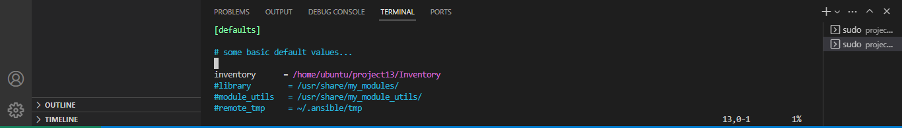
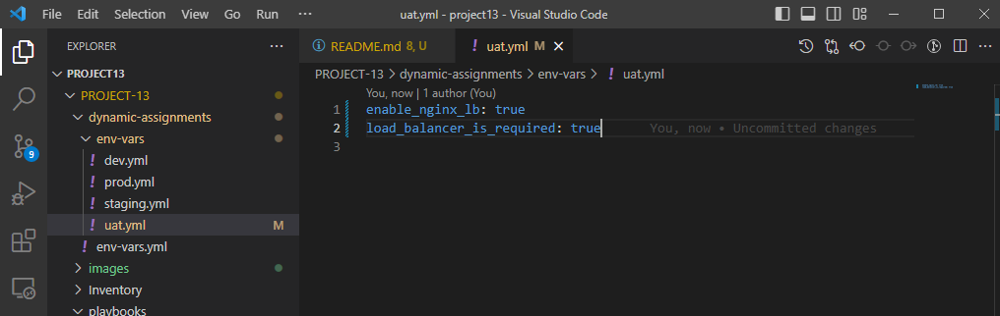

**ANSIBLE DYNAMIC ASSIGNMENTS (INCLUDE) AND COMMUNITY ROLES**

*IMPORTANT NOTICE*: Ansible is an actively developing software project, so you are encouraged to visit [Ansible Documentation](https://www.https://docs.ansible.com) for the latest updates on modules and their usage.

- In the Last 2 projects have already equipped us with some knowledge and skills on Ansible, so we can perform configurations using playbooks, roles and imports. Now we will continue configuring your UAT servers learning and practicing new Ansible concepts and modules.

- In this project we will introduce dynamic assignments by using include module.

**INTRODUCING DYNAMIC ASSIGNMENT INTO OUR STRUCTURE**

- In your `https://github.com/your-name/ansible-config-mgt` GitHub repository start a new branch and call it dynamic-assignments.
- Create a new folder, name it dynamic-assignments. Then inside this folder, create a new file and name it env-vars.yml.We will instruct site.yml to include this playbook later
- Your GitHub shall have following structure by now.

- Now paste the instruction below into the env-vars.yml file. check file permisions `ls-la` make sure its set to ubuntu

`---`
`- name: collate variables ``from env specific file, if`it `exists`
  `hosts: all`
 `tasks:`
    `- name: looping through ``list of available files`
      `include_vars: "{{ ``item }}"`
      `with_first_found:`
        `- files:`
            `- dev.yml`
           `- stage.yml`
            `- prod.yml`
           `- uat.yml`
         `paths:`
           `- "{{ ``playbook_dir }}/../``dynamic-assignmen`t`s/env.vars"`
      `tags:`
       `- always`

**UPDATE SITE.YML WITH DYNAMIC ASSIGNMENTS**

- Now we need to update our site.yml to make use of dynamic-assignments

- site.yml should now look like this.

`---`
`- hosts: all`
`- name: Include dynamic ``variables`
  `tasks:`
  `import_playbook: ../``static-assignments/common.``yml`
  `include: ../``dynamic-assignments/``env-vars.yml`
  `tags:`
    `- always`

`-  hosts: webservers`
`- name: Webserver assignment`
  `import_playbook: ../``static-assignments/``webservers.yml`

**Download Mysql Ansible Role**

- On Jenkins-Ansible server make sure that git is installed with git --version, then go to ‘ansible-config-mgt’ directory and run

`git init`
`git pull https://github.com/your-name/``ansible-config-mgt.git`
`git remote add origin ``https://github.com/``<your-name>/``ansible-config-mgt.git`
`git branch roles-feature`
`git switch roles-feature`

- Inside roles directory create your new MySQL role with `ansible-galaxy install geerlingguy.mysql` and rename the folder to mysql

`cd roles`
`mv geerlingguy.mysql/ mysql`

- Read README.md file, and edit roles configuration to use correct credentials for MySQL required for the tooling website.
- `cd roles`
- `> mysql>defaults>main.yml` and edit

- Inside roles directory create your new apache role with `ansible-galaxy install geerlingguy.apache` and rename the folder to apache
`cd roles`
`mv geerlingguy.apache/ apache`

- Read README.md file, and edit roles configuration for apache

- Inside roles directory create your new apache role with `ansible-galaxy install geerlingguy.nginx` and rename the folder to nginx
`cd roles`
`mv geerlingguy.nginx/ nginx`

- Do thesame for webserver and configure

- NOTE: Make sure to update our role path and inventory file as thus
`sudo vi /etc/ansible/ansible.cfg`
- paste the following

- Now it is time to upload the changes into your GitHub:

`git add .`
`git commit -m "Commit new ``role files into GitHub"`
`git push --set-upstream ``origin roles-feature`

**LOAD BALANCER ROLES**

- We want to be able to choose which Load Balancer to use, Nginx or Apache, so we need to have two roles respectively:

1. Nginx
2. Apache

- With your experience on Ansible so far you can: 
- Decide if you want to develop your own roles, or find available ones from the community
- Update both static-assignment and site.yml files to refer the roles

- Since you cannot use both Nginx and Apache load balancer, you need to add a condition to enable either one – this is where you can make use of variables.

- Declare a variable in defaults/main.yml file inside the Nginx and Apache roles. Name each variables enable_nginx_lb and enable_apache_lb respectively.

- Set both values to false like this enable_nginx_lb: false and enable_apache_lb: false.

- Declare another variable in both roles load_balancer_is_required and set its value to false as well

- Update both assignment and site.yml files respectively

`loadbalancers.yml file`

`- hosts: lb`
  `roles:`
    `- { role: nginx, when: ``enable_nginx_lb and ``load_balancer_is_require``d }`
    `- { role: apache, when: ``enable_apache_lb and ``load_balancer_is_required }`

`site.yml file`

`- name: Loadbalancers ``assignment`
       `hosts: lb`
         `- ``import_playbook: ../static-assignments/loadbalancers.yml`
       ` when: ``load_balancer_is_required `

- Now you can make use of env-vars\uat.yml file to define which loadbalancer to use in UAT environment by setting respective environmental variable to true.

- You will activate load balancer, and enable nginx by setting these in the respective environment’s env-vars file.

- The same must work with apache LB, so you can switch it by setting respective environmental variable to true and other to false.

- To test this, you can update inventory for each environment and run Ansible against each environment

- Now run our playbook ,we run uat.yml file against the site.yml

`cd project13`
`ansible-playbook -i /home/ubuntu/project13/Inventory/uat.yml /home/ubuntu/project13/playbooks/site.yml`

- Set Nginx load_balancer to true
- 

- Set Apache load_balancer to true

**Congratulations!**

You have learned and practiced how to use Ansible configuration management tool to prepare UAT environment for Tooling web solution.